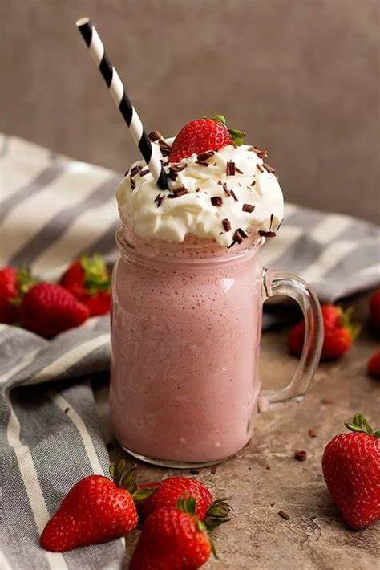

# Dogffee

## A melhor cafeteria do estado
Cafeteria Dogffee 
 aonde o café é tão bom que vai te fazer latir de alegria!!

## imagem do site

## Exemplares
 
Café com espuma 
 
Cappuccino cremoso 
 
Café de morango 

## Descrição dos produtos
Deliciosos cafés produzidos com amor da receita da dona Chica

## Entrega
pode chegar na sua casa dentro de 1h
# Tecnologias utilizadas 
*`HTML5` 
*`CSS3` 
*`Git` 
*`Github` 

## Ferramentas utilizadas 
* `VScode` 

## Matérias utilizadas para a produção do site
Fundamentos de Desenvolvimento Web: 
Professor [Leonardo](https://github.com/leonardorochamarista) 

